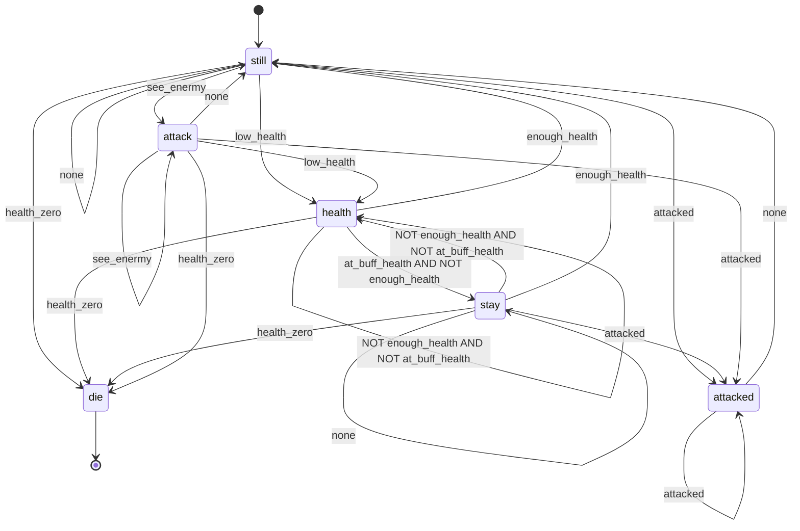

### 简易决策模拟器

#### 回合

按照回合进行模拟和结算

#### 机器人

**机器人具有的属性：** 血量，攻击力，防御力

**机器人能执行的动作：** 移动（上下左右），改变朝向（八个朝向），开火

每个回合机器人只能采取一种动作

#### 场地

n×m的网格，有以下元素：

- 回血点：左下角和右上角的正方形区域，机器人处于此区域时每回合回复一定血量
- 增益点：随机生成的正方形区域（暂定），每个回合机器人处于此区域时会获得增益
- 障碍：暂定是场地中间有一个长条形区域，会阻碍机器人开火和机器人视野

#### 一些设定

1. 初版只模拟两个机器人，手动操作
2. 视野：机器人的视野是以朝向为中轴线，左右对称的共90度扇形区域，每回合开始时，如果有敌人处于此区域内且连线上没有障碍物的话，系统会向这个机器人发送视野内所有敌人的坐标
3. 开火：如果机器人本回合内选择开火，机器人朝向上的第一个敌人将在下个回合开始时受到伤害，开火可以被障碍物阻挡
4. 实现：用 ROS 实现，通信采用 ROS 的服务通信模型

### 2023-12-03

- 暂时假定机器人具有全视野（八个方向）

#### 更新计划

1. 获取视线内所有机器人的坐标：改为由机器人自己获取，不是裁判系统获取并发送
2. 添加机器人简易的状态机系统，取代现在的完全随机行动
3. （次优先）添加裁判系统的状态机系统，以更好地适应以后更加复杂的裁判系统扩展
4. （更次优先）改为 ros+qt 来取代现在的简易 opencv 绘图

#### 简易机器人状态机系统

##### 状态

- 攻击（attack）：进攻的状态
  - 行为：将朝向对准敌人朝向，如果已经对准，就会开火，自身不会移动
- 受到攻击（attacked）：受到攻击的状态
  - 行为：会进行一次随机移动，然后如果没有受到攻击，就会回到待命状态
- 回血（health）：表示需要回血的状态
  - 行为：导航并移动到回血点
- 静止（stay）：表示不能进行移动，但是可以开火，调转朝向的状态
  - 行为：如果看到敌人就会尝试对准朝向，对准就会开火
- 待命（still）：表示无任何异常情况的状态，开局状态
  - 每回合随机移动和改变朝向，不会开火
- 死亡（die）：结束状态
  - 行为：向裁判系统发送死亡信息，然后退出

##### 触发条件

- 看到敌人（see_enermy）：视野内有敌人时触发
- 受到攻击（attacked）：受到攻击时触发
- 血量低（low_health）：血量低于最大值的 40% 时触发
- 血量足（enough_health）：血量高于最大值的 60% 是触发
- 处于回血点（at_buff_health）：位于回血点时触发
- 血量归零（health_zero）：血量为0时触发
- 其他（none）：表示不满足其他任何特殊条件时的转移
- 无条件（all）：下个回合会直接转移到另一个状态

##### 一些设定

- 状态之间的转移边必须由上面的触发条件组成
- 一条边可以只含单个条件，也可以含有多个条件，各个条件之间用逻辑关系来组合（与或非）
- 每条边都有优先级，从优先级高的开始判断，如果优先级一样则顺序不能保证
- 其他（none）优先级最低，无条件（all）优先级最高，且它们不能和其他条件组合

##### 流程

每回合开始时，先进行状态转移，然后再执行当前状态对应的行动

##### 暂定的状态机图

